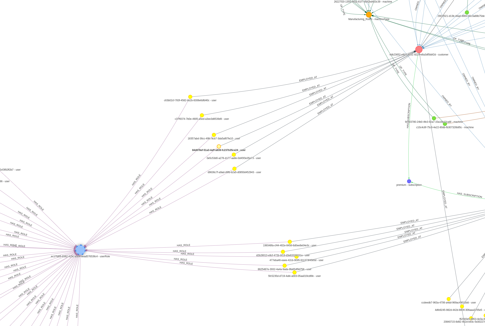

# Graph-Data
## Creates a mocked graph data structure and provides a way to traverse it.

<!--
*** Written by Martin Karlsson
*** www.martinkarlsson.io
-->

[![LinkedIn][linkedin-shield]][linkedin-url]

<!-- ABOUT THE PROJECT -->
## About The Project

Intention with this project is to provide a boilerplate for creating a graph data structure and a way to traverse it.
The solution is built around ArangoDB and Python.
The mocked data will populate with typical enterprise data for industrial use cases.
<br>
This kind of graphs are often referred to as Knowledge Graphs or Enterprise Knowledge Graphs (EKG) and are used to represent complex relationships between entities. It can capture the relationships between people, places, things, and events. It can also capture the relationships between data and the context in which it is used.
<br>
EKGs are used to provide context to data and to enable more advanced analytics and AI. They are also used to provide a common understanding of the data and to enable collaboration between different parts of the organization.
<br>
#### What does the code do?
The code will first initiate an ArangoDB container and then populate it with data. The data is then used to create a graph data structure. The graph is then traversed and the results are printed to the console.
ArangoDB UI is available at http://localhost:8529/ (no credentials needed for this example).
<br>
#### Example AQL Query and Response
##### Query
```
FOR v, e, p IN 1..5 OUTBOUND 'machine/5de5bdd8-4b3d-414d-ac2a-30b02d0e189d' GRAPH 'main' RETURN { verticesIds: p.vertices[*]._id, edges: p.edges[*].label}
```
##### Response
```
[{'verticesIds': ['machine/8dfa7bd3-7676-4b57-90ed-9fe0e41ce235', 'software/39ba7f75-6636-4460-ad59-bd3ea4faccd9'], 'edges': ['RUNS_SOFTWARE']}, {'verticesIds': ['machine/8dfa7bd3-7676-4b57-90ed-9fe0e41ce235', 'customer/dd52d8af-f051-4494-8db0-6bc71b040d29'], 'edges': ['OWNED_BY']}, {'verticesIds': ['machine/8dfa7bd3-7676-4b57-90ed-9fe0e41ce235', 'customer/dd52d8af-f051-4494-8db0-6bc71b040d29', 'region/apac'], 'edges': ['OWNED_BY', 'IN_REGION']}, {'verticesIds': ['machine/8dfa7bd3-7676-4b57-90ed-9fe0e41ce235', 'customer/dd52d8af-f051-4494-8db0-6bc71b040d29', 'subscription/standard'], 'edges': ['OWNED_BY', 'HAS_SUBSCRIPTION']}, {'verticesIds': ['machine/8dfa7bd3-7676-4b57-90ed-9fe0e41ce235', 'region/eu'], 'edges': ['OPERATES_IN']}, {'verticesIds': ['machine/8dfa7bd3-7676-4b57-90ed-9fe0e41ce235', 'machineType/Truck_S9'], 'edges': ['OF_TYPE']}]
```

#### Graph Overview
These images are captured from ArangoDB's UI and shows the graph data structure created from the mocked data.


#### Graph Customer


#### Graph Users


##### Tech Stack
<ul>
<li>ArangoDB [ https://arangodb.com/ ]</li>
<li>Docker [ https://www.docker.com/ ]</li>
</ul>

### Pre-requisites
<li>Install Docker https://www.docker.com/</li>
<li>Python 3.8 or later</li>

### Start
Recommended to use virtual environment for Python.
```python -m venv venv```
```source venv/bin/activate```
```pip install -r requirements.txt```
```python main.py```


<!-- CONTACT -->
## Contact

### Martin Karlsson

LinkedIn : [martin-karlsson][linkedin-url] \
Twitter : [@HelloKarlsson](https://twitter.com/HelloKarlsson) \
Email : hello@martinkarlsson.io \
Webpage : [www.martinkarlsson.io](https://www.martinkarlsson.io)


Project Link: [github.com/martinkarlssonio/graph-data](https://github.com/martinkarlssonio/graph-data)


<!-- MARKDOWN LINKS & IMAGES -->
[linkedin-shield]: https://img.shields.io/badge/-LinkedIn-black.svg?style=for-the-badge&logo=linkedin&colorB=555
[linkedin-url]: https://linkedin.com/in/martin-karlsson